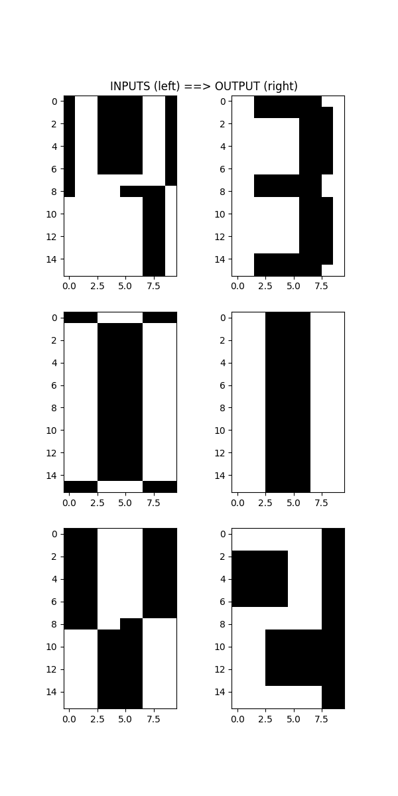

<!--------------------------------------------------------------------------------------->

# 1. One Step Error Probability

## 1.1 Code

```python
import time
import random
import argparse
import numpy as np

def signum(value):
    """
    Compute signum for a float value.
    """
    return -1 if value < 0 else 1

def generate_random_patterns(p, N):
    """
    Generate `p` random patterns, each with `N` bits/neurons.
    """
    patterns = np.random.randint(2, size=(p, N))
    patterns[patterns == 0] = -1
    return patterns

def compute_weight_matrix(stored_patterns, row=None, zerodiag=False):
    """
    Create weight matrix for Hopfield network using Hebb's rule.

    Args:
        stored_patterns (ndarray): Tensor of shape `(p, N)` containing `p` stored patterns, each
            represented by `N` neurons/bits.

        row (int): Create weight matrix only for this row, such that the return value will have the
            shape of `(1, N)` (where N is the number of bits in each stored pattern). If no row is
            given, then the entire weight matrix of shape `(N, N)` will be computed.

        zerodiag (bool): If true, the weights along the diagonal of the weight matrix will be zeroed
            out. Otherwise, the diagonal weights will be computed using the normal Hebb's rule.

    Returns:
        The weight matrix of shape `(1, N)` if row is given. Otherwise, the entire matrix of shape
        `(N, N)` will be returned.
    """
    N = stored_patterns.shape[1]
    W = stored_patterns if row is None else stored_patterns[:, row, None]
    W = (W.T @ stored_patterns) / N

    if zerodiag:
        if row is None:
            np.fill_diagonal(W, 0)
        else:
            W[:,row] = 0
    return W

def compute_one_step_error_probability(p, N=120, n_trials=int(1e5), zerodiag=False):
    """
    Compute one-step error probability for Hopfield network

    Args:
        p (int): Number of stored patterns.

        N (int): Number of bits/neurons in each pattern.

        n_trials (int): Number of trials for computing the one-step error probability.

        zerodiag (bool): If true, the weights along the diagonal of the weight matrix will be zeroed
            out. Otherwise, the diagonal weights will be computed using the normal Hebb's rule.

    Returns:
        A float representing the one-step error probability.
    """

    print("Computing probability for {} stored patterns...".format(p))
    start_time = time.time()
    errors = 0

    for i in range(n_trials):
        selected_neuron = random.randrange(N)
        selected_pattern = random.randrange(p)

        stored_patterns = generate_random_patterns(p, N)
        W = compute_weight_matrix(stored_patterns, row=selected_neuron, zerodiag=zerodiag)

        updated_neuron = signum(np.dot(W[0], stored_patterns[selected_pattern]))
        if updated_neuron != stored_patterns[selected_pattern, selected_neuron]:
            errors = errors + 1

    probability = errors / n_trials
    print("  Prob: {:.5f}".format(probability))
    print("  Time: {} seconds".format(time.time() - start_time))
    return probability

def main(args):
    ps = [12, 24, 48, 70, 100, 120]
    probs = [compute_one_step_error_probability(p, zerodiag=args.zerodiag) for p in ps]

    print()
    print("p   | probability")
    print("----|------------")

    for p, prob in zip(ps, probs):
        print("{:<3d} | {:.5f}".format(p, prob))

if __name__ == "__main__":
    parser = argparse.ArgumentParser(
        description="Compute one-step error probability for Hopfield network"
    )
    parser.add_argument(
        "--zerodiag",
        "-z",
        action="store_true",
        help="Zero out all the weights along the diagonal of the weight matrix"
    )
    main(parser.parse_args())
```

## 1.2. Results

With weight matrix having **zero** diagonals, I get the following results:

```
    $ python3 OneStepErrorProbability.py --zerodiag

    Computing probability for 12 stored patterns...
    Prob: 0.00052
    Time: 4.172587156295776 seconds
    Computing probability for 24 stored patterns...
    Prob: 0.01140
    Time: 5.4861860275268555 seconds
    Computing probability for 48 stored patterns...
    Prob: 0.05458
    Time: 7.858587741851807 seconds
    Computing probability for 70 stored patterns...
    Prob: 0.09360
    Time: 9.817108154296875 seconds
    Computing probability for 100 stored patterns...
    Prob: 0.13691
    Time: 12.687513828277588 seconds
    Computing probability for 120 stored patterns...
    Prob: 0.15650
    Time: 14.801092863082886 seconds

    p   | probability
    ----|------------
    12  | 0.00052
    24  | 0.01140
    48  | 0.05458
    70  | 0.09360
    100 | 0.13691
    120 | 0.15650
```

With weight matrix having **non-zero** diagonals, I get the following results:

```
    $ python3 OneStepErrorPropability.py

    Computing probability for 12 stored patterns...
    Prob: 0.00012
    Time: 4.316368103027344 seconds
    Computing probability for 24 stored patterns...
    Prob: 0.00284
    Time: 5.483811378479004 seconds
    Computing probability for 48 stored patterns...
    Prob: 0.01238
    Time: 7.717572927474976 seconds
    Computing probability for 70 stored patterns...
    Prob: 0.01924
    Time: 9.802137613296509 seconds
    Computing probability for 100 stored patterns...
    Prob: 0.02217
    Time: 12.803136348724365 seconds
    Computing probability for 120 stored patterns...
    Prob: 0.02202
    Time: 14.67278242111206 seconds

    p   | probability
    ----|------------
    12  | 0.00012
    24  | 0.00284
    48  | 0.01238
    70  | 0.01924
    100 | 0.02217
    120 | 0.0220
```

As you can see, the one-step error probability is a much lower for the **non-zero** diagonals, which
means that the network has less errors if fed with the same pattern as one of the stored patterns.

This is no surprise, because these non-zero weights along the diagonals will act as strong attractor
to pull the fed pattern into one of the stored pattern, thus making sure that the network will less
likely to make a mistake if the fed pattern is one of the stored pattern. This can be quite good as
$\alpha=p/N$ gets smaller, because the network is more likely to be "confused" when the number of
patterns increases.

<!--------------------------------------------------------------------------------------->
\newpage

# 2. Recognizing Digits

## 2.1. Code

```python
import argparse
import numpy as np
import matplotlib.pyplot as plt

digits = [
    np.array([[-1,-1,-1,-1,-1,-1,-1,-1,-1,-1], [-1,-1,-1,+1,+1,+1,+1,-1,-1,-1],
              [-1,-1,+1,+1,+1,+1,+1,+1,-1,-1], [-1,+1,+1,+1,-1,-1,+1,+1,+1,-1],
              [-1,+1,+1,+1,-1,-1,+1,+1,+1,-1], [-1,+1,+1,+1,-1,-1,+1,+1,+1,-1],
              [-1,+1,+1,+1,-1,-1,+1,+1,+1,-1], [-1,+1,+1,+1,-1,-1,+1,+1,+1,-1],
              [-1,+1,+1,+1,-1,-1,+1,+1,+1,-1], [-1,+1,+1,+1,-1,-1,+1,+1,+1,-1],
              [-1,+1,+1,+1,-1,-1,+1,+1,+1,-1], [-1,+1,+1,+1,-1,-1,+1,+1,+1,-1],
              [-1,+1,+1,+1,-1,-1,+1,+1,+1,-1], [-1,-1,+1,+1,+1,+1,+1,+1,-1,-1],
              [-1,-1,-1,+1,+1,+1,+1,-1,-1,-1], [-1,-1,-1,-1,-1,-1,-1,-1,-1,-1]]),

    np.array([[-1,-1,-1,+1,+1,+1,+1,-1,-1,-1], [-1,-1,-1,+1,+1,+1,+1,-1,-1,-1],
              [-1,-1,-1,+1,+1,+1,+1,-1,-1,-1], [-1,-1,-1,+1,+1,+1,+1,-1,-1,-1],
              [-1,-1,-1,+1,+1,+1,+1,-1,-1,-1], [-1,-1,-1,+1,+1,+1,+1,-1,-1,-1],
              [-1,-1,-1,+1,+1,+1,+1,-1,-1,-1], [-1,-1,-1,+1,+1,+1,+1,-1,-1,-1],
              [-1,-1,-1,+1,+1,+1,+1,-1,-1,-1], [-1,-1,-1,+1,+1,+1,+1,-1,-1,-1],
              [-1,-1,-1,+1,+1,+1,+1,-1,-1,-1], [-1,-1,-1,+1,+1,+1,+1,-1,-1,-1],
              [-1,-1,-1,+1,+1,+1,+1,-1,-1,-1], [-1,-1,-1,+1,+1,+1,+1,-1,-1,-1],
              [-1,-1,-1,+1,+1,+1,+1,-1,-1,-1], [-1,-1,-1,+1,+1,+1,+1,-1,-1,-1]]),

    np.array([[+1,+1,+1,+1,+1,+1,+1,+1,-1,-1], [+1,+1,+1,+1,+1,+1,+1,+1,-1,-1],
              [-1,-1,-1,-1,-1,+1,+1,+1,-1,-1], [-1,-1,-1,-1,-1,+1,+1,+1,-1,-1],
              [-1,-1,-1,-1,-1,+1,+1,+1,-1,-1], [-1,-1,-1,-1,-1,+1,+1,+1,-1,-1],
              [-1,-1,-1,-1,-1,+1,+1,+1,-1,-1], [+1,+1,+1,+1,+1,+1,+1,+1,-1,-1],
              [+1,+1,+1,+1,+1,+1,+1,+1,-1,-1], [+1,+1,+1,-1,-1,-1,-1,-1,-1,-1],
              [+1,+1,+1,-1,-1,-1,-1,-1,-1,-1], [+1,+1,+1,-1,-1,-1,-1,-1,-1,-1],
              [+1,+1,+1,-1,-1,-1,-1,-1,-1,-1], [+1,+1,+1,-1,-1,-1,-1,-1,-1,-1],
              [+1,+1,+1,+1,+1,+1,+1,+1,-1,-1], [+1,+1,+1,+1,+1,+1,+1,+1,-1,-1]]),

    np.array([[-1,-1,+1,+1,+1,+1,+1,+1,-1,-1], [-1,-1,+1,+1,+1,+1,+1,+1,+1,-1],
              [-1,-1,-1,-1,-1,-1,+1,+1,+1,-1], [-1,-1,-1,-1,-1,-1,+1,+1,+1,-1],
              [-1,-1,-1,-1,-1,-1,+1,+1,+1,-1], [-1,-1,-1,-1,-1,-1,+1,+1,+1,-1],
              [-1,-1,-1,-1,-1,-1,+1,+1,+1,-1], [-1,-1,+1,+1,+1,+1,+1,+1,-1,-1],
              [-1,-1,+1,+1,+1,+1,+1,+1,-1,-1], [-1,-1,-1,-1,-1,-1,+1,+1,+1,-1],
              [-1,-1,-1,-1,-1,-1,+1,+1,+1,-1], [-1,-1,-1,-1,-1,-1,+1,+1,+1,-1],
              [-1,-1,-1,-1,-1,-1,+1,+1,+1,-1], [-1,-1,-1,-1,-1,-1,+1,+1,+1,-1],
              [-1,-1,+1,+1,+1,+1,+1,+1,+1,-1], [-1,-1,+1,+1,+1,+1,+1,+1,-1,-1]]),

    np.array([[-1,+1,+1,-1,-1,-1,-1,+1,+1,-1], [-1,+1,+1,-1,-1,-1,-1,+1,+1,-1],
              [-1,+1,+1,-1,-1,-1,-1,+1,+1,-1], [-1,+1,+1,-1,-1,-1,-1,+1,+1,-1],
              [-1,+1,+1,-1,-1,-1,-1,+1,+1,-1], [-1,+1,+1,-1,-1,-1,-1,+1,+1,-1],
              [-1,+1,+1,-1,-1,-1,-1,+1,+1,-1], [-1,+1,+1,+1,+1,+1,+1,+1,+1,-1],
              [-1,+1,+1,+1,+1,+1,+1,+1,+1,-1], [-1,-1,-1,-1,-1,-1,-1,+1,+1,-1],
              [-1,-1,-1,-1,-1,-1,-1,+1,+1,-1], [-1,-1,-1,-1,-1,-1,-1,+1,+1,-1],
              [-1,-1,-1,-1,-1,-1,-1,+1,+1,-1], [-1,-1,-1,-1,-1,-1,-1,+1,+1,-1],
              [-1,-1,-1,-1,-1,-1,-1,+1,+1,-1], [-1,-1,-1,-1,-1,-1,-1,+1,+1,-1]]),
]

inputs = [
    np.array([[+1,-1,-1,+1,+1,+1,+1,-1,-1,+1], [+1,-1,-1,+1,+1,+1,+1,-1,-1,+1],
              [+1,-1,-1,+1,+1,+1,+1,-1,-1,+1], [+1,-1,-1,+1,+1,+1,+1,-1,-1,+1],
              [+1,-1,-1,+1,+1,+1,+1,-1,-1,+1], [+1,-1,-1,+1,+1,+1,+1,-1,-1,+1],
              [+1,-1,-1,+1,+1,+1,+1,-1,-1,+1], [+1,-1,-1,-1,-1,-1,-1,-1,-1,+1],
              [+1,-1,-1,-1,-1,+1,+1,+1,+1,-1], [-1,-1,-1,-1,-1,-1,-1,+1,+1,-1],
              [-1,-1,-1,-1,-1,-1,-1,+1,+1,-1], [-1,-1,-1,-1,-1,-1,-1,+1,+1,-1],
              [-1,-1,-1,-1,-1,-1,-1,+1,+1,-1], [-1,-1,-1,-1,-1,-1,-1,+1,+1,-1],
              [-1,-1,-1,-1,-1,-1,-1,+1,+1,-1], [-1,-1,-1,-1,-1,-1,-1,+1,+1,-1]]),

    np.array([[+1,+1,+1,-1,-1,-1,-1,+1,+1,+1], [-1,-1,-1,+1,+1,+1,+1,-1,-1,-1],
              [-1,-1,-1,+1,+1,+1,+1,-1,-1,-1], [-1,-1,-1,+1,+1,+1,+1,-1,-1,-1],
              [-1,-1,-1,+1,+1,+1,+1,-1,-1,-1], [-1,-1,-1,+1,+1,+1,+1,-1,-1,-1],
              [-1,-1,-1,+1,+1,+1,+1,-1,-1,-1], [-1,-1,-1,+1,+1,+1,+1,-1,-1,-1],
              [-1,-1,-1,+1,+1,+1,+1,-1,-1,-1], [-1,-1,-1,+1,+1,+1,+1,-1,-1,-1],
              [-1,-1,-1,+1,+1,+1,+1,-1,-1,-1], [-1,-1,-1,+1,+1,+1,+1,-1,-1,-1],
              [-1,-1,-1,+1,+1,+1,+1,-1,-1,-1], [-1,-1,-1,+1,+1,+1,+1,-1,-1,-1],
              [-1,-1,-1,+1,+1,+1,+1,-1,-1,-1], [+1,+1,+1,-1,-1,-1,-1,+1,+1,+1]]),

    np.array([[+1,+1,+1,-1,-1,-1,-1,+1,+1,+1], [+1,+1,+1,-1,-1,-1,-1,+1,+1,+1],
              [+1,+1,+1,-1,-1,-1,-1,+1,+1,+1], [+1,+1,+1,-1,-1,-1,-1,+1,+1,+1],
              [+1,+1,+1,-1,-1,-1,-1,+1,+1,+1], [+1,+1,+1,-1,-1,-1,-1,+1,+1,+1],
              [+1,+1,+1,-1,-1,-1,-1,+1,+1,+1], [+1,+1,+1,-1,-1,-1,-1,+1,+1,+1],
              [+1,+1,+1,-1,-1,+1,+1,-1,-1,-1], [-1,-1,-1,+1,+1,+1,+1,-1,-1,-1],
              [-1,-1,-1,+1,+1,+1,+1,-1,-1,-1], [-1,-1,-1,+1,+1,+1,+1,-1,-1,-1],
              [-1,-1,-1,+1,+1,+1,+1,-1,-1,-1], [-1,-1,-1,+1,+1,+1,+1,-1,-1,-1],
              [-1,-1,-1,+1,+1,+1,+1,-1,-1,-1], [-1,-1,-1,+1,+1,+1,+1,-1,-1,-1]]),
]

def signum(value):
    """
    Compute signum for a float value.
    """
    return -1 if value < 0 else 1

def compute_weight_matrix(stored_patterns, row=None, zerodiag=False):
    """
    Create weight matrix for Hopfield network using Hebb's rule.

    Args:
        stored_patterns (ndarray): Tensor of shape `(p, N)` containing `p` stored patterns, each
            represented by `N` neurons/bits.

        row (int): Create weight matrix only for this row, such that the return value will have the
            shape of `(1, N)` (where N is the number of bits in each stored pattern). If no row is
            given, then the entire weight matrix of shape `(N, N)` will be computed.

        zerodiag (bool): If true, the weights along the diagonal of the weight matrix will be zeroed
            out. Otherwise, the diagonal weights will be computed using the normal Hebb's rule.

    Returns:
        The weight matrix of shape `(1, N)` if row is given. Otherwise, the entire matrix of shape
        `(N, N)` will be returned.
    """
    N = stored_patterns.shape[1]
    W = stored_patterns if row is None else stored_patterns[:, row, None]
    W = (W.T @ stored_patterns) / N

    if zerodiag:
        if row is None:
            np.fill_diagonal(W, 0)
        else:
            W[:,row] = 0
    return W

def run_hopfield_network(input_pattern, weight_matrix):
    """
    Run the Hopfield network by asynchronously updating all neurons until convergence.
    The asynchronous updates are done using the typewriter scheme.

    Args:
        input_pattern (ndarray): Tensor of shape `(w, h)` representing the input pattern.

        weight_matrix (ndarray): Tensor of shape `(N, N)` representing weight matrix of the network,
            where `N = w * h` is the number of neurons/bits of the network.

    Returns:
        Tensor of shape `(w, h)` representing the final pattern produced by the network.
    """
    pattern = input_pattern.flatten()
    N = len(pattern)
    total_updates = 0

    while True:
        converged = True
        total_updates += N

        for i in range(N):
            updated_neuron = signum(np.dot(weight_matrix[i], pattern))
            converged &= (updated_neuron == pattern[i])
            pattern[i] = updated_neuron

        if converged:
            break

    pattern = pattern.reshape(input_pattern.shape)
    recognized_digit = "Unknown"

    for (i, digit) in enumerate(digits):
        if np.array_equal(pattern, digit):
            recognized_digit = str(i)
        elif np.array_equal(pattern, -digit):
            recognized_digit = "Inverted " + str(i)

    print("Number of asynchronous updates:", total_updates)
    print("Recognized digit:", recognized_digit)
    print(pattern, "\n")
    return pattern

def main(args):
    stored_patterns = np.array([digit.flatten() for digit in digits])
    W = compute_weight_matrix(stored_patterns, zerodiag=True)
    outputs = [run_hopfield_network(P, W) for P in inputs]

    n_rows, n_cols = len(inputs), 2
    fig = plt.figure(figsize=(3 * n_cols, 4 * n_rows))
    plt.title("INPUTS (left) ==> OUTPUT (right)")
    plt.axis("off")

    for i in range(n_rows):
        fig.add_subplot(n_rows, n_cols, i * n_cols + 1)
        plt.imshow(inputs[i], cmap="gray_r")
        fig.add_subplot(n_rows, n_cols, i * n_cols + 2)
        plt.imshow(outputs[i], cmap="gray_r")

    plt.savefig(args.outdir + "/RecognizingDigits.png")
    plt.show()

if __name__ == "__main__":
    parser = argparse.ArgumentParser(
        description="Recognizing distorted digits using Hopfield network"
    )
    parser.add_argument(
        "--outdir",
        "-o",
        type=str,
        default=".",
        help="Out directory to output the image",
    )
    main(parser.parse_args())
```

## 2.2. Results

Since there're $16\times 10=160$ neurons/bits, the results below show that convergence occurs after:

* 480 asynchronous updates $\equiv$ 3 synchronous updates for 1st pattern, converging to digit 3.
* 320 asynchronous updates $\equiv$ 2 synchronous updates for 2nd pattern, converging to digit 1.
* 320 asynchronous updates $\equiv$ 2 synchronous updates for 3rd pattern, converging to inverted digit 2.

Printouts:
```
    $ python3 RecognizingDigits.py

    Number of asynchronous updates: 480
    Recognized digit: 3
    [[-1 -1  1  1  1  1  1  1 -1 -1]
    [-1 -1  1  1  1  1  1  1  1 -1]
    [-1 -1 -1 -1 -1 -1  1  1  1 -1]
    [-1 -1 -1 -1 -1 -1  1  1  1 -1]
    [-1 -1 -1 -1 -1 -1  1  1  1 -1]
    [-1 -1 -1 -1 -1 -1  1  1  1 -1]
    [-1 -1 -1 -1 -1 -1  1  1  1 -1]
    [-1 -1  1  1  1  1  1  1 -1 -1]
    [-1 -1  1  1  1  1  1  1 -1 -1]
    [-1 -1 -1 -1 -1 -1  1  1  1 -1]
    [-1 -1 -1 -1 -1 -1  1  1  1 -1]
    [-1 -1 -1 -1 -1 -1  1  1  1 -1]
    [-1 -1 -1 -1 -1 -1  1  1  1 -1]
    [-1 -1 -1 -1 -1 -1  1  1  1 -1]
    [-1 -1  1  1  1  1  1  1  1 -1]
    [-1 -1  1  1  1  1  1  1 -1 -1]]

    Number of asynchronous updates: 320
    Recognized digit: 1
    [[-1 -1 -1  1  1  1  1 -1 -1 -1]
    [-1 -1 -1  1  1  1  1 -1 -1 -1]
    [-1 -1 -1  1  1  1  1 -1 -1 -1]
    [-1 -1 -1  1  1  1  1 -1 -1 -1]
    [-1 -1 -1  1  1  1  1 -1 -1 -1]
    [-1 -1 -1  1  1  1  1 -1 -1 -1]
    [-1 -1 -1  1  1  1  1 -1 -1 -1]
    [-1 -1 -1  1  1  1  1 -1 -1 -1]
    [-1 -1 -1  1  1  1  1 -1 -1 -1]
    [-1 -1 -1  1  1  1  1 -1 -1 -1]
    [-1 -1 -1  1  1  1  1 -1 -1 -1]
    [-1 -1 -1  1  1  1  1 -1 -1 -1]
    [-1 -1 -1  1  1  1  1 -1 -1 -1]
    [-1 -1 -1  1  1  1  1 -1 -1 -1]
    [-1 -1 -1  1  1  1  1 -1 -1 -1]
    [-1 -1 -1  1  1  1  1 -1 -1 -1]]

    Number of asynchronous updates: 320
    Recognized digit: Inverted 2
    [[-1 -1 -1 -1 -1 -1 -1 -1  1  1]
    [-1 -1 -1 -1 -1 -1 -1 -1  1  1]
    [ 1  1  1  1  1 -1 -1 -1  1  1]
    [ 1  1  1  1  1 -1 -1 -1  1  1]
    [ 1  1  1  1  1 -1 -1 -1  1  1]
    [ 1  1  1  1  1 -1 -1 -1  1  1]
    [ 1  1  1  1  1 -1 -1 -1  1  1]
    [-1 -1 -1 -1 -1 -1 -1 -1  1  1]
    [-1 -1 -1 -1 -1 -1 -1 -1  1  1]
    [-1 -1 -1  1  1  1  1  1  1  1]
    [-1 -1 -1  1  1  1  1  1  1  1]
    [-1 -1 -1  1  1  1  1  1  1  1]
    [-1 -1 -1  1  1  1  1  1  1  1]
    [-1 -1 -1  1  1  1  1  1  1  1]
    [-1 -1 -1 -1 -1 -1 -1 -1  1  1]
    [-1 -1 -1 -1 -1 -1 -1 -1  1  1]]
```

Image of the results is shown below. In the image, the left column is the input patterns, and the
right column is the final patterns after convergence.



<!--------------------------------------------------------------------------------------->
\newpage

# 3. Stochastic Hopfield Network

## 3.1. Code

To speed up the computation, I use the `multiprocessing` package, which supports thread-safe queues,
where the main thread can give tasks to the worker threads via `tasks_queue` and the worker threads
can write back the results via the `done_queue`.

A task for each worker thread is simply a single trial run, where the thread will compute the order
parameter for a network that stores some random patterns. Once the order paramemters are computed
for all experiments, the main thread will take the average and print out the final results.

**********************

```python
import time
import random
import argparse
import numpy as np
import multiprocessing as mp
from progressbar import progressbar # pip install progressbar2

def noisy_sigmoid(value, beta=2):
    """
    Compute the noisy sigmoid activation in stochastic Hopfield network, with noise parameter beta.
    """
    return 1 / (1 + np.exp(-2 * beta * value))

def generate_random_patterns(p, N=200):
    """
    Generate `p` random patterns, each with `N` bits/neurons.
    """
    patterns = np.random.randint(2, size=(p, N))
    patterns[patterns == 0] = -1
    return patterns

def compute_weight_matrix(stored_patterns, row=None, zerodiag=True):
    """
    Create weight matrix for Hopfield network using Hebb's rule.

    Args:
        stored_patterns (ndarray): Tensor of shape `(p, N)` containing `p` stored patterns, each
            represented by `N` neurons/bits.

        row (int): Create weight matrix only for this row, such that the return value will have the
            shape of `(1, N)` (where N is the number of bits in each stored pattern). If no row is
            given, then the entire weight matrix of shape `(N, N)` will be computed.

        zerodiag (bool): If true, the weights along the diagonal of the weight matrix will be zeroed
            out. Otherwise, the diagonal weights will be computed using the normal Hebb's rule.

    Returns:
        The weight matrix of shape `(1, N)` if row is given. Otherwise, the entire matrix of shape
        `(N, N)` will be returned.
    """
    N = stored_patterns.shape[1]
    W = stored_patterns if row is None else stored_patterns[:, row, None]
    W = (W.T @ stored_patterns) / N

    if zerodiag:
        if row is None:
            np.fill_diagonal(W, 0)
        else:
            W[:,row] = 0
    return W

def run_experiment(p, T=int(2e5)):
    """
    Run one trial by creating a stochastic Hopfield network and compute its order parameter.

    Args:
        p (int): Number of random patterns to store in the network.

        T (int): Number of asynchronous updates used for computing the order parameter.

    Returns:
        A number representing the order parameter of the stochastic Hopfield network.
    """
    order_param = 0
    random_patterns = generate_random_patterns(p)
    W = compute_weight_matrix(random_patterns)

    input_pattern = random_patterns[0]
    pattern = np.copy(input_pattern)
    N = len(pattern)

    for _ in range(T):
        random_neuron = random.randrange(N)
        prob = noisy_sigmoid(np.dot(W[random_neuron], pattern))
        pattern[random_neuron] = 1 if random.random() <= prob else -1
        order_param += np.dot(pattern, input_pattern) / N / T

    return order_param

def worker_thread(tasks_queue, done_queue):
    """
    Worker thread will take one task from the `tasks_queue`, run the experiment, and then put the
    final result (order parameter) into the `done_queue`.
    """
    while True:
        p = tasks_queue.get(block=True)
        order_parameter = run_experiment(p)
        done_queue.put(order_parameter)

def main_thread(args):
    """
    Main thread will initialize worker threads and compute the average order parameter of all runs.
    """
    order_params = []
    tasks_queue = mp.Queue()
    done_queue = mp.Queue()
    workers = mp.Pool(args.n_workers, initializer=worker_thread, initargs=(tasks_queue, done_queue))

    for _ in range(args.n_trials):
        tasks_queue.put(args.p)

    for _ in progressbar(range(args.n_trials)):
        order_param = done_queue.get(block=True)
        order_params.append(order_param)

    workers.terminate()
    workers.join()
    print("Average order parameter: {:.3f}".format(sum(order_params) / len(order_params)))

if __name__ == "__main__":
    parser = argparse.ArgumentParser(
        description="Compute order parameter for stochastic Hopfield network"
    )
    parser.add_argument(
        "p",
        type=int,
        help="Number of stored patterns"
    )
    parser.add_argument(
        "--n-workers",
        "-w",
        default=12,
        type=int,
        help="Number of parallel workers"
    )
    parser.add_argument(
        "--n-trials",
        "-t",
        default=100,
        type=int,
        help="Number of trials to perform for computing the average order parameter"
    )
    start_time = time.time()
    main_thread(parser.parse_args())
    print("Total time taken: {} seconds".format(time.time() - start_time))
```

## 3.2. Results

With $p=7$, I get the following results:
```
    $ python3 StochasticHopfieldNetwork.py 7

    100% (100 of 100) |####################################| Elapsed Time: 0:00:18 Time:  0:00:18
    Average order parameter: 0.855
    Total time taken: 19.351770401000977 seconds
```

With $p=45$, I get the following results:
```
    $ python3 StochasticHopfieldNetwork.py 45

    100% (100 of 100) |####################################| Elapsed Time: 0:00:19 Time:  0:00:19
    Average order parameter: 0.156
    Total time taken: 19.952781200408936 seconds
```
