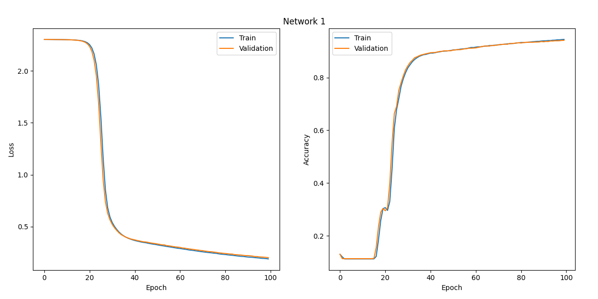
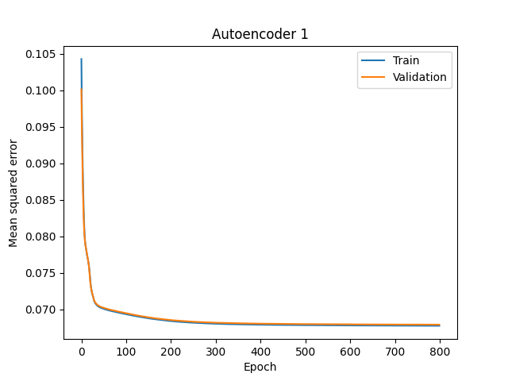
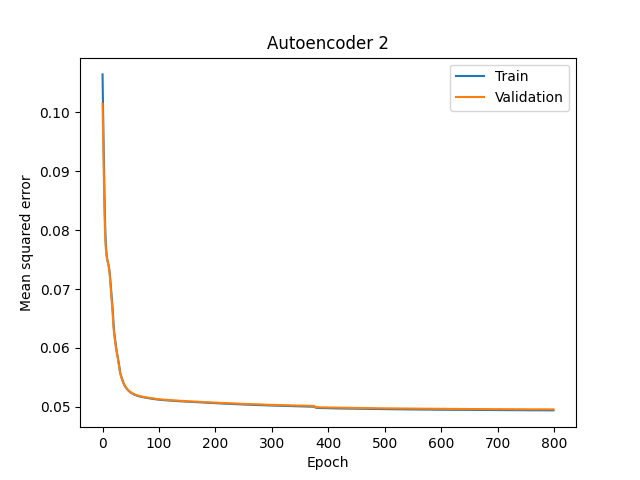
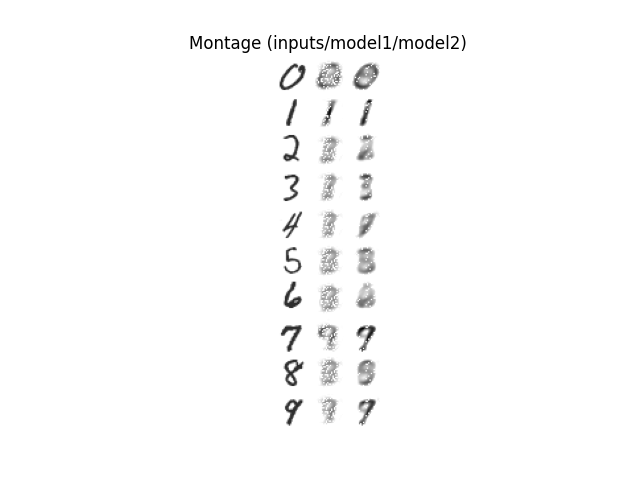
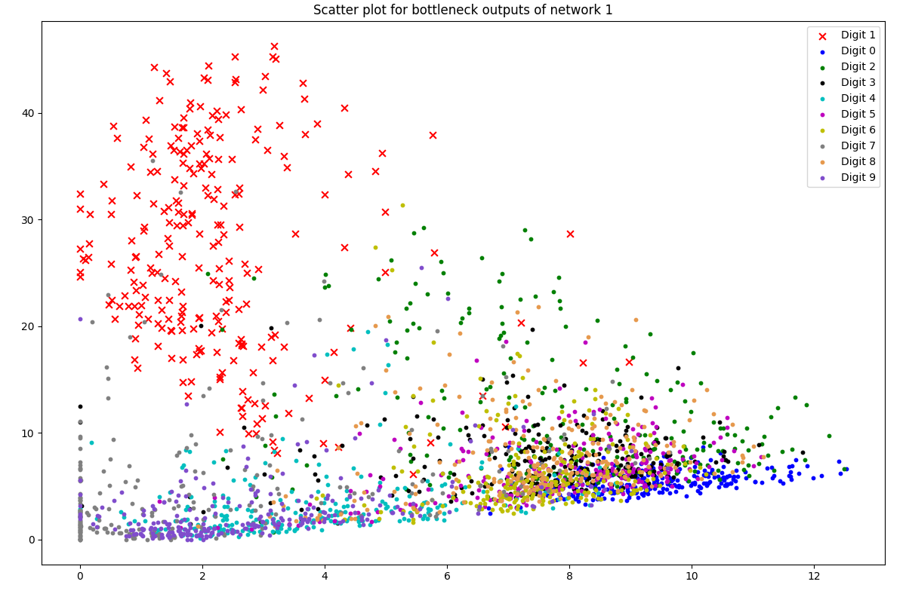
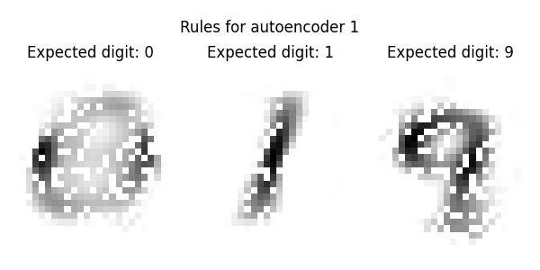
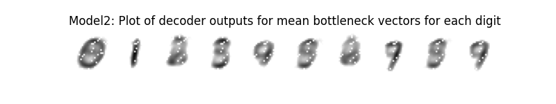
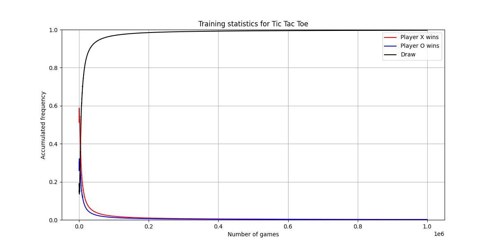

<!--------------------------------------------------------------------------------------->

# 1. Convolutional networks

## 1.1. Presentation of results


*Figure 1: Training performance of network 1*


*Figure 2: Training performance of network 2*

*Table 1: Training performance of network 2:*

|          | Train Accuracy | Validation Accuracy | Test Accuracy |
|----------|----------------|---------------------|---------------|
| Network1 | 0.94446        | 0.94090             | 0.94630       |
| Network2 | 0.99998        | 0.99050             | 0.99080       |

Analysis of the results:

* Compared to network1 (that has only 1 convolutional layer), network2 is much deeper as it has 3
    convolutional layers with batch-norm in between. The deep structure allows network2 to pack more
    non-linearity that would allow the network to learn more complex features from the images.
* As you can see from the Figure 1 and Figure 2, network2 overfits much faster on the training set,
    while network2 has very much the same performance on both training and validation set across all
    epochs. This is because the deeper structure makes network2 more vulnerable to noises from the
    training set.
* However, as training goes on, network2 is able to give a better overall performance than network2
    on the same number of epochs. This is no suprise, since network2 is deeper, and thus yields a
    better performance, but only if it's trained long enough.

I have done my implementation using Keras API of Tensorflow 2.2. Since the assignment was written
for Matlab, I had to make a couple of changes to make it work in Python:

* Instead of using the provided `LoadMNIST.m` script, I wrote my own method for loading the MNIST
    dataset from Tensorflow, and split it into train/val/test set with ratio of 50000/10000/10000.
    Since Tensorflow only provides train and test set, I had to create validation set by randomly
    sample 10000 data points from the original train set.
* Tensorflow defines `ValidationFrequency` with respect to number of *epochs*, instead of number of
    *iterations* as in Matlab. So for simplicity, I took the liberty to perform evaluation on the
    validation set once every epoch.
* I set the learning rate for both networks to be 0.01, and the max number of epochs is set to 100.

\newpage

## 1.2. Code

```python
import os
import argparse
import numpy as np
import tensorflow as tf
import matplotlib.pyplot as plt
from tensorflow.keras.optimizers import SGD
from tensorflow.keras.initializers import RandomNormal
from tensorflow.keras.callbacks import EarlyStopping
from tensorflow.keras.losses import SparseCategoricalCrossentropy
from tensorflow.keras.layers import Conv2D, Dense, Flatten, MaxPool2D, InputLayer, BatchNormalization

def load_mnist(val_seed=None):
    """
    Load, pre-process, and split the MNIST dataset into train/val/test sets.

    Arguments:
        val_seed (int): Seed to generate the validation set.

    Returns:
        (x_train, y_train): ndarray of shape (50000, 28, 28, 1) and (50000,) representing train set.
        (x_val, y_val)    : ndarray of shape (10000, 28, 28, 1) and (10000,) representing val set.
        (x_test, y_test)  : ndarray of shape (10000, 28, 28, 1) and (10000,) representing test set.
    """
    saved_random_generator_state = np.random.get_state()
    np.random.seed(val_seed)

    (x, y), (x_test, y_test) = tf.keras.datasets.mnist.load_data()
    x, x_test = np.expand_dims(x, axis=3), np.expand_dims(x_test, axis=3)
    x, x_test = x / 255.0, x_test / 255.0

    indices = np.random.permutation(x.shape[0])
    train_indices, val_indices = indices[:50000], indices[50000:]
    x_train, y_train = x[train_indices], y[train_indices]
    x_val, y_val = x[val_indices], y[val_indices]

    print("[INFO] Train set shapes:", x_train.shape, y_train.shape)
    print("[INFO] Validation set shapes:", x_val.shape, y_val.shape)
    print("[INFO] Test set shapes:", x_test.shape, y_test.shape)

    np.random.set_state(saved_random_generator_state)
    return (x_train, y_train), (x_val, y_val), (x_test, y_test)

def predict(model, inputs):
    return tf.argmax(tf.nn.softmax(model(inputs)), axis=-1)

def construct_network1():
    model = tf.keras.models.Sequential([
        InputLayer(input_shape=(28, 28, 1)),
        Conv2D(20, 5, kernel_initializer=RandomNormal(0, 0.01), padding="same", activation="relu"),
        MaxPool2D(pool_size=2, strides=2, padding="same"),
        Flatten(),
        Dense(100, kernel_initializer=RandomNormal(0, 0.01), activation="relu"),
        Dense(10, kernel_initializer=RandomNormal(0, 0.01)),
    ])
    model.compile(
        optimizer=SGD(learning_rate=0.01, momentum=0.9),
        loss=SparseCategoricalCrossentropy(from_logits=True),
        metrics=["accuracy"],
    )
    model.summary()
    return model

def construct_network2():
    model = tf.keras.models.Sequential([
        InputLayer(input_shape=(28, 28, 1)),
        Conv2D(20, 3, kernel_initializer=RandomNormal(0, 0.01), padding="same", activation="relu"),
        BatchNormalization(),
        MaxPool2D(pool_size=2, strides=2, padding="same"),
        Conv2D(30, 3, kernel_initializer=RandomNormal(0, 0.01), padding="same", activation="relu"),
        BatchNormalization(),
        MaxPool2D(pool_size=2, strides=2, padding="same"),
        Conv2D(50, 3, kernel_initializer=RandomNormal(0, 0.01), padding="same", activation="relu"),
        BatchNormalization(),
        MaxPool2D(pool_size=2, strides=2, padding="same"),
        Flatten(),
        Dense(10, kernel_initializer=RandomNormal(0, 0.01)),
    ])
    model.compile(
        optimizer=SGD(learning_rate=0.01, momentum=0.9),
        loss=SparseCategoricalCrossentropy(from_logits=True),
        metrics=["accuracy"],
    )
    model.summary()
    return model

def main(args):
    training_performance = None
    (x_train, y_train), (x_val, y_val), (x_test, y_test) = load_mnist(val_seed=123)
    model = construct_network1() if args.network == 1 else construct_network2()

    if args.model_file is not None:
        print("\n[INFO] Loading model from " + args.model_file)
        model = tf.keras.models.load_model(args.model_file)

    else:
        print("\n[INFO] No model file is given, proceed to training")
        training_performance = model.fit(
            x_train,
            y_train,
            validation_data=(x_val, y_val),
            shuffle=True,
            batch_size=8192,
            epochs=100,
            callbacks=EarlyStopping(patience=5),
        )
        training_performance = training_performance.history
        fig = plt.figure(figsize=(12, 6))
        plt.title("Network {}".format(args.network))
        plt.tight_layout(pad=2.5)
        plt.axis("off")

        fig.add_subplot(1, 2, 1)
        plt.plot(training_performance["loss"])
        plt.plot(training_performance["val_loss"])
        plt.legend(['Train', 'Validation'])
        plt.ylabel("Loss")
        plt.xlabel("Epoch")

        fig.add_subplot(1, 2, 2)
        plt.plot(training_performance["accuracy"])
        plt.plot(training_performance["val_accuracy"])
        plt.legend(['Train', 'Validation'])
        plt.ylabel("Accuracy")
        plt.xlabel("Epoch")

        plt.savefig("{}/network{}.png".format(args.outdir, args.network))
        model.save("{}/network{}.h5".format(args.outdir, args.network))

    print("\n[INFO] Evaluating the model on the test set")
    test_loss, test_accuracy = model.evaluate(x_test, y_test)

    print("\n[INFO] Runing predictions on the first 5 samples of the test set:")
    print("[INFO] Expected: [7 2 1 0 4], Actual: {}".format(predict(model, x_test[0:5])))

    print("\n[INFO] Test accuracy:", test_accuracy)
    if training_performance is not None:
        print("[INFO] Training accuracy:", training_performance["accuracy"][-1])
        print("[INFO] Validation accuracy:", training_performance["val_accuracy"][-1])

if __name__ == "__main__":
    parser = argparse.ArgumentParser(description="Convolutional networks for MNIST")
    parser.add_argument("network", type=int, choices=[1, 2], help="Network to be run")
    parser.add_argument("--model-file", "-mf", type=str, default=None, help="Path to the saved model")
    parser.add_argument("--outdir", "-o", type=str, default=".", help="Out directory")
    args = parser.parse_args()

    os.environ["TF_CPP_MIN_LOG_LEVEL"] = "2" # remove info/warning logs from tensorflow
    gpus = tf.config.experimental.list_physical_devices("GPU")

    if len(gpus) > 0:
        try:
            tf.config.experimental.set_memory_growth(gpus[0], True)
        except RuntimeError as e:
            print(e)

    print("[INFO] Using Tensorflow version:", tf.__version__)
    print("[INFO] Number of GPUs available:", len(gpus))
    main(args)
```

<!--------------------------------------------------------------------------------------->

\newpage

# 2. Autoencoders

## 2.1. Presentation of results

Figure 1 and Figure 2 below show the training progress for autoencoder 1 and autoencoder 2. As can
be seen, the training performance sharply increases within only the first 50 epochs or so, and then
quickly levels off as the training goes on. Validation patience can actually be used here to reduce
the training time by stopping early. However, since the training goes very quickly on my GPU, so I
decided to run the network all the way until epoch 800.

Autoencoder 1 reaches approximately the final loss of 0.067, while autoencoder 2 got the lowest loss
of 0.049. Clearly, autoencoder 2 performs better, which is no surprise because autoencoder 2 has
more hidden units in the bottleneck layer, thus is able to include more information.



*Figure 1: Training performance of autoencoder 1*



*Figure 2: Training performance of autoencoder 2*



*Figure 3: Montage where first column is the inputs, second column is the outputs of autoencoder 1,
and third column is the outputs of autoencoder 2.*

As can be seen here in the montage in Figure 3:

* Autoencoder 1 seems to be able to predict digit 1 very well. Digits 0 and 9 can be recognized a
    bit, if we don't judge harshly. The rest of the digits are really bad.
* Autoencoder 2 seems to perform well on digits 0, 1, 3, and 9. Other digits are not so bad either,
    as the forms of the digits can be recognized.



*Figure 4: Scatter plot showing the outputs of the bottleneck layers for autoencoder 1. Here, the X
markers represent well-recognized digits and O markers represent the non-well-recognized digits.*

As shown in the scatter plot in Figure 3:

* Digit 1 is the most well-recognized digit, so I plotted that with X marker.
* Even though digit 0 and digit 9 are plotted with O marker, they are a little bit better the other
    digits. However, they can't be called as "well-recognized", since digit 9 can still be mistaken
    as digit 7, and digit 0 can still be mistaken as other digits (at least it overlaps quite a bit
    with the plots of other digits).

\newpage

From the scatter plot (Figure 4), it looks like the upper left corner is the region that most likely
belongs to digit 1. The lower left corner is the region for digit 9 (though it can also be mistaken
as digit 7). And the lower right corner is the regiion for digit 0 (though it can also be mistaken
for other digits in the same region as well). To test these "rules", I created 3 points in 2D at
these corners. Then I simply passed these 3 inputs into the decoder, and to see if the decoder can
generate the expected digits.

* For digit 0, I chose the point `(12, 4)` in the right bottom corner.
* For digit 1, I chose the point `(2, 40)` in the upper left corner.
* For digit 9, I chose the point `(1.5, 0)` in the left bottom corner.



*Figure 5: Outputs from the decoder of autoencoder 1, given the points `(12, 4)` and `(2, 40)` and
`(1.5, 0)` as inputs to the decoder.*

To find the coding rule for autoencoder 2, let's compute the mean output vectors of the encoder for
each of the digits. Here is the result:

```
[INFO] Mean bottleneck vectors for each digit:
Digit 0 ==> [10.978588  12.026303   6.9547396  8.330039 ]
Digit 1 ==> [37.925915 15.457135 71.48261  12.837233]
Digit 2 ==> [6.7864785 7.5168977 6.0474663 3.2689466]
Digit 3 ==> [14.517906  12.474363  10.927933   7.5871468]
Digit 4 ==> [ 7.212148  6.836543 12.227403 13.035679]
Digit 5 ==> [11.919395 12.632617 11.724218 10.654239]
Digit 6 ==> [5.9780188 6.209823  5.099382  4.002297 ]
Digit 7 ==> [12.8656845 12.9306755 30.59925   27.417377 ]
Digit 8 ==> [11.773857 12.73176  13.145078 10.882374]
Digit 9 ==> [10.887202   9.4659815 18.285233  18.306738 ]
```



*Figure 6: Outputs from the decoder of autencoder 2, given the mean bottleneck vectors as inputs
for each of the digits. Here digits 0, 1, 9 are classified pretty well. Digits 3 and 7 are also
quite good (though it's a bit blurry, and 7 looks a bit like a 9).*

\newpage

By inspection of the mean bottleneck vectors above, I managed to work out a couple rules of thumb,
at least for the well-classified digits such as 0, 1, and 9.

* For digit 0: The first 2 dimensions are big, the last 2 only half as big. The 2nd dimension is
    slightly bigger than the 1st dimension, and the 4th dimension is slightly bigger than the 3rd
    dimension. To fit this critieria, I have chosen this point: `(50, 60, 30, 40)`.
* For digit 1: The 1st and 3rd dimensions are big, the 2nd and 4th dimensions are small. The 1st
    dimension is approximately half as big as the 3rd dimension. To fit this critieria, I have
    chosen this point: `(50, 10, 90, 10)`.
* For digit 9: The first 2 dimensions are approximately half as big as the last 2 dimensions. To fit
    this criteria, I have chosen this point: `(50, 50, 90, 90)`.

Passing these points to the decoder, we get the outputs as in Figure 7. All 3 digits are classified
correctly, which means the rules of thumb that I found worked quite well.


*Figure 7: Outputs from the decoder of autencoder 2, given the points `(50, 60, 30, 40)` and
`(50, 10, 90, 10)` and `(50, 50, 90, 90)` as inputs.*

\newpage

## 2.2. Code

```python
import os
import argparse
import numpy as np
import tensorflow as tf
import matplotlib.pyplot as plt
from tensorflow.keras.layers import Dense, InputLayer


def load_mnist(val_seed=None):
    """
    Load, pre-process, and split the MNIST dataset into train/val/test sets.

    Arguments:
        val_seed (int): Seed to generate the validation set.

    Returns:
        (x_train, y_train): ndarray of shape (50000, 784) and (50000,) representing train set.
        (x_val, y_val)    : ndarray of shape (10000, 784) and (10000,) representing val set.
        (x_test, y_test)  : ndarray of shape (10000, 784) and (10000,) representing test set.
    """
    saved_random_generator_state = np.random.get_state()
    np.random.seed(val_seed)

    (x, y), (x_test, y_test) = tf.keras.datasets.mnist.load_data()
    x, x_test = x.reshape(60000, 784), x_test.reshape(10000, 784)
    x, x_test = x / 255.0, x_test / 255.0

    indices = np.random.permutation(x.shape[0])
    train_indices, val_indices = indices[:50000], indices[50000:]
    x_train, y_train = x[train_indices], y[train_indices]
    x_val, y_val = x[val_indices], y[val_indices]

    print("[INFO] Train set shapes:", x_train.shape, y_train.shape)
    print("[INFO] Validation set shapes:", x_val.shape, y_val.shape)
    print("[INFO] Test set shapes:", x_test.shape, y_test.shape)

    np.random.set_state(saved_random_generator_state)
    return (x_train, y_train), (x_val, y_val), (x_test, y_test)


def construct_network(bottleneck_size):
    """
    Construct the autoencoder network.

    Arguments:
        bottleneck_size (int): Number of neurons in the bottleneck layer.

    Returns:
        model: The model containing the entire autoencoder network.
    """
    model = tf.keras.models.Sequential([
        InputLayer(input_shape=(784)),
        Dense(50, kernel_initializer="glorot_uniform", activation="relu"),
        Dense(bottleneck_size, kernel_initializer="glorot_uniform", activation="relu"),
        Dense(784, kernel_initializer="glorot_uniform", activation="relu"),
    ])
    model.compile(
        optimizer=tf.optimizers.Adam(learning_rate=0.001),
        loss="mean_squared_error",
    )
    model.summary()
    return model


def split_network(model):
    """
    Split the network into 2 parts (encoder and decoder)

    Arguments:
        model (Sequential): The sequential model to be split.

    Returns:
        The encoder and decoder as 2 separate networks.
    """
    first_layer = model.get_layer(index=0)
    bottleneck_layer = model.get_layer(index=1)
    last_layer = model.get_layer(index=2)

    encoder = tf.keras.models.Sequential([
        InputLayer(input_shape=(784)),
        first_layer,
        bottleneck_layer,
    ])
    decoder = tf.keras.models.Sequential([
        InputLayer(input_shape=(bottleneck_layer.units)),
        last_layer,
    ])
    return encoder, decoder


def train_network(mnist, network, outdir):
    """
    Train the autoencoder network.

    Arguments:
        network (int): Either 1 or 2, indicating which autoencoder network to train.
        outdir (str):  Directory to save the output to.
    """
    print("\n[INFO] Training network {}".format(network))
    (x_train, y_train), (x_val, y_val), (x_test, y_test) = mnist
    model = construct_network(2 if network == 1 else 4)

    training_performance = model.fit(
        x_train,
        x_train,
        validation_data=(x_val, x_val),
        shuffle=True,
        batch_size=8192,
        epochs=800,
        verbose=2,
    )
    training_performance = training_performance.history
    plt.figure()
    plt.title("Autoencoder {}".format(network))
    plt.plot(training_performance["loss"])
    plt.plot(training_performance["val_loss"])
    plt.legend(['Train', 'Validation'])
    plt.ylabel("Mean squared error")
    plt.xlabel("Epoch")
    plt.savefig("{}/autoencoder{}.png".format(outdir, network))
    model.save("{}/autoencoder{}.h5".format(outdir, network))


def load_network(network, outdir):
    """
    Load a trained autoencoder network.

    Arguments:
        network (int): Either 1 or 2, indicating which autoencoder network to train.
        outdir (str):  Directory to load the model from.

    Returns:
        The trained model.
    """
    print("\n[INFO] Loading model from {}/autoencoder{}.h5".format(outdir, network))
    return tf.keras.models.load_model("{}/autoencoder{}.h5".format(outdir, network))


def create_montage(mnist, model1, model2, outdir, test_seed=None):
    """
    Create montage to compare results between model1 and model2 on random samples from the test set.

    Args:
        mnist:     The MNIST dataset as loaded from load_mnist().
        model1:    The loaded model for autoencoder 1.
        model2:    The loaded model for autoencoder 2.
        outdir:    Directory to save the montage to.
        test_seed: Seed to randomly sample 10 digits from the test set.
    """
    (x_train, y_train), (x_val, y_val), (x_test, y_test) = mnist
    saved_random_generator_state = np.random.get_state()
    np.random.seed(test_seed)
    indices = [np.random.choice(np.where(y_test == i)[0]) for i in range(10)]
    np.random.set_state(saved_random_generator_state)

    inputs = x_test[indices].reshape(280, 28)
    output1 = model1.predict(x_test[indices]).reshape(280, 28)
    output2 = model2.predict(x_test[indices]).reshape(280, 28)
    montage = np.concatenate([inputs, output1, output2], axis=1)

    plt.figure()
    plt.title("Montage (inputs/model1/model2)")
    plt.imshow(montage, cmap="gray_r")
    plt.axis("off")
    plt.savefig("{}/montage.png".format(outdir))


def create_scatter(mnist, encoder, decoder, outdir):
    """
    Create scatter plot for outputs of the bottleneck layer of the first autoencoder.

    Arguments:
        mnist:   The MNIST dataset as loaded from load_mnist().
        encoder: Encoder of the first autoencoder.
        decoder: Decoder of the first autoencoder.
        outdir:  Directory to save the scatter plot to.
    """
    (x_train, y_train), (x_val, y_val), (x_test, y_test) = mnist

    def scatter(digit, color, n, well_recognized):
        indices = np.where(y_test == digit)[0][:250]
        outputs = encoder.predict(x_test[indices])
        marker = "x" if well_recognized else "."
        label = "Digit " + str(digit)
        plt.scatter(outputs[:,0], outputs[:,1], c=color, marker=marker, s=40, label=label)

    good_digits = [1]
    good_colors = ["r"]
    bad_digits  = [0, 2, 3, 4, 5, 6, 7, 8, 9]
    bad_colors  = ["b", "g", "k", "c", "m", "y", [(.5, .5, .5)], [(.9, .6, .3)], [(.5, .3, .8)]]

    plt.figure(figsize=(12,8))
    [scatter(d, c, 100, well_recognized=True) for d, c in zip(good_digits, good_colors)]
    [scatter(d, c, 100, well_recognized=False) for d, c in zip(bad_digits, bad_colors)]
    plt.legend()
    plt.tight_layout(pad=2)
    plt.title("Scatter plot for bottleneck outputs of network 1")
    plt.savefig("{}/scatter.png".format(outdir))


def do_experiment_on_model1_rules(decoder, outdir):
    """
    Find the rules for the first autoencoder. Here we are gonna try to create the digit 1 (which is
    well-recognized), and digits 0/9 (which are somewhat well-recognized), by only using the decoder
    of the first autoencoder. The idea is to use the coordinates that are "well-separated" from the
    scatter plots, and see if the decoder will give the expected digits or not.
    """
    fig = plt.figure(figsize=(6,3))
    plt.title("Rules for autoencoder 1")
    plt.axis("off")

    def generate(counter, digit, bottleneck_point):
        fig.add_subplot(1, 3, counter)
        plt.axis("off")
        plt.title("Expected digit: " + str(digit))
        output = decoder.predict(bottleneck_point).reshape(28,28)
        plt.tight_layout(pad=0)
        plt.imshow(output, cmap="gray_r")

    generate(1, digit=0, bottleneck_point=np.array([[12, 4]]))
    generate(2, digit=1, bottleneck_point=np.array([[2, 40]]))
    generate(3, digit=9, bottleneck_point=np.array([[1.5, 0]]))
    plt.savefig(outdir + "/rules_model1.png")


def do_experiment_on_model2_rules(mnist, encoder, decoder, outdir):
    """
    Find the rules for the second autoencoder. Here we are gonna try to find the mean bottleneck
    output vectors for each digit, and then feed those mean vectors to the decoder to see if we get
    the expected digits or not.
    """
    (x_test, y_test), (x_val, y_val), (x_test1, y_test1) = mnist
    bottleneck_vectors = encoder.predict(x_test)
    mean_vectors = [np.mean(bottleneck_vectors[y_test == digit], axis=0) for digit in range(10)]

    print("\n[INFO] Mean bottleneck vectors for each digit:")
    for digit, mean in enumerate(mean_vectors):
        print("Digit {} ==> {}".format(digit, mean))

    decoder_inputs = np.array(mean_vectors)
    decoder_outputs = decoder.predict(decoder_inputs)
    decoder_outputs = np.concatenate(decoder_outputs.reshape(10,28,28), axis=1)

    plt.figure(figsize=(8, 1.5))
    plt.title("Model2: Plot of decoder outputs for mean bottleneck vectors for each digit")
    plt.imshow(decoder_outputs, cmap="gray_r")
    plt.axis("off")
    plt.savefig("{}/mean_vector_outputs.png".format(outdir))

    fig = plt.figure(figsize=(6,3))
    plt.title("Rules for autoencoder 2")
    plt.axis("off")

    def generate(counter, digit, bottleneck_point):
        fig.add_subplot(1, 3, counter)
        plt.axis("off")
        plt.title("Expected digit: " + str(digit))
        output = decoder.predict(bottleneck_point).reshape(28,28)
        plt.tight_layout(pad=0)
        plt.imshow(output, cmap="gray_r")

    generate(1, digit=0, bottleneck_point=np.array([[50, 60, 30, 40]]))
    generate(2, digit=1, bottleneck_point=np.array([[50, 10, 90, 10]]))
    generate(3, digit=9, bottleneck_point=np.array([[50, 50, 90, 90]]))
    plt.savefig(outdir + "/rules_model2.png")


def main(args):
    """
    Main program to train and evaluate autoencoders.
    """
    mnist = load_mnist(val_seed=123)

    if not args.no_training:
        train_network(mnist, 1, args.outdir)
        train_network(mnist, 2, args.outdir)

    model1 = load_network(1, args.outdir)
    model2 = load_network(2, args.outdir)
    encoder1, decoder1 = split_network(model1)
    encoder2, decoder2 = split_network(model2)

    create_montage(mnist, model1, model2, args.outdir)
    create_scatter(mnist, encoder1, decoder1, args.outdir)
    do_experiment_on_model1_rules(decoder1, args.outdir)
    do_experiment_on_model2_rules(mnist, encoder2, decoder2, args.outdir)


if __name__ == "__main__":
    parser = argparse.ArgumentParser(description="Autoencoder networks for MNIST")
    parser.add_argument("--no-training", "-nt", action="store_true", help="Perform no training")
    parser.add_argument("--outdir", "-o", type=str, default=".", help="Out directory")
    args = parser.parse_args()

    os.environ["TF_CPP_MIN_LOG_LEVEL"] = "2" # remove info/warning logs from tensorflow
    gpus = tf.config.experimental.list_physical_devices("GPU")

    if len(gpus) > 0:
        try:
            tf.config.experimental.set_memory_growth(gpus[0], True)
        except RuntimeError as e:
            print(e)

    print("[INFO] Using Tensorflow version:", tf.__version__)
    print("[INFO] Number of GPUs available:", len(gpus))
    main(args)
```

<!--------------------------------------------------------------------------------------->

\newpage

# 3. Tic Tac Toe

## 3.1. Presentation of results


*Figure 1: Learning curves smoothed over a window of 30. The training used $\alpha=0.1$, $\gamma=1$*,
$\varepsilon=0.5$ (which is kept the same for the first $10^3$ episodes, and then is decreased by a
factor $0.9$ after every $100$th episode). The train runs for $10^6$ episodes.

Implementation:

* The `State` class represents a single entry in the Q-table. It's basically a combination of a
    board configuration and its corresponding Q-values. The class is also responsible for update
    the Q-values based on the SARSA equation, make epsilon-greedy move for a specific player, and
    check if the game has ended and who has won.
* The `Player` class represents a single player. Each player stores all the states that it has seen
    so far across all the games. The player also stores all the states that it has seen so far in
    the current game together with the chosen moves, such that the player can then update all the
    Q-values of these states at the end of each game.
* For training, we loop through all the games, and for each game, each player takes its turn until
    the game has reached its terminal state. Only then will the players update Q-values of their
    states.

Analysis of the results:

* In the beginning, there are not so many draws. But as the training goes on, both players get
    better and better, and thus by the end of the training, almost every game ends in a draw.
* Since we are using epsilon decay techniques (in which $\varepsilon$ is decayed towards 0 as the
    training goes on), in the beginning, the players are allowed to explore more, instead of always
    making the moves with the highest future rewards known so far. During this exploration phase,
    moves are made more randomly, and thus it's more random on who's gonna win. However, as training
    goes on, the moves made by the players are more and more greedy (i.e., both players are trying
    to play at the best ability), thus draws happen more often.

\newpage
## 3.2. Code

```python
import argparse
import numpy as np
import matplotlib.pyplot as plt
from progressbar import progressbar # pip install progressbar2

# Global constants
alpha = 0.1
gamma = 1
eps_initial = 0.5
eps_decay = 0.9
eps_decay_freq = 100
eps_decay_start = int(1e3)
n_games = int(1e6)
window_size = 30


class State:
    """
    State is a combination of a board configuration and its corresponding Q values.
    """

    def __init__(self, board=np.zeros(shape=(9,), dtype=np.int8)):
        """
        Initialize a state using a numpy board configuration.
        """
        self.board = board
        self.id = str(board)
        self.q_values = np.zeros(board.shape, dtype=np.float64)
        self.q_values[board != 0] = np.nan

    def to_numpy(self):
        """
        Return a 6-by-3 numpy array containing both the board configuration and its Q values.
        """
        board = self.board.reshape(3, 3)
        q_values = self.q_values.reshape(3, 3)
        return np.concatenate([board, q_values], axis=0)

    def is_filled(self):
        """
        Check if the entire board has been filled.
        """
        return 0 not in self.board

    def is_a_win(self, player):
        """
        Check if this state represents a win for a given player.
        """
        board = self.board.reshape(3, 3)
        winning_sum = 3 * player.id

        return (winning_sum in board.sum(axis=0)          # check columns
             or winning_sum in board.sum(axis=1)          # check rows
             or winning_sum == board.trace()              # check diagonal
             or winning_sum == np.fliplr(board).trace())  # check anti-diagonal

    def eps_greedy_move(self, player, eps):
        """
        Make an epsilon-greedy move for a given player. Return the chosen move, the new state to the
        opposite player, the reward for the move, and whether the game has reached a terminal state.
        """
        greedy_move = np.nanargmax(self.q_values)
        valid_moves = ~np.isnan(self.q_values)
        invalid_moves = np.isnan(self.q_values)

        eps_greedy_policy = np.ones(self.q_values.shape) * (eps / np.sum(valid_moves))
        eps_greedy_policy[greedy_move] += (1 - eps)
        eps_greedy_policy[invalid_moves] = 0

        chosen_move = np.random.choice(len(self.q_values), p=eps_greedy_policy)
        new_board = np.copy(self.board)
        new_board[chosen_move] = player.id
        new_state = State(board=new_board)

        reward = 1 if new_state.is_a_win(player) else 0
        terminal = reward == 1 or new_state.is_filled()
        return chosen_move, new_state, reward, terminal

    def update_q(self, move, reward, next_state):
        """
        Update the Q value of a specific move using the SARSA equation.
        """
        delta = alpha * (reward + gamma * np.nanmax(next_state.q_values) - self.q_values[move])
        self.q_values[move] += delta


class Player:
    """
    Representation of a player, storing all the states that the player has seen so far.
    """

    def __init__(self, player_name, player_id):
        """
        Create a new player with a specific ID.
        """
        self.name = player_name
        self.id = player_id
        self.q_table = {}       # stores all the states the player has seen so far across all games
        self.statistics = []    # stores win/loss/draw statistics for the player
        self.game_records = []  # records of all decisions made by a player during a game

    def get_average_accum_freq(self, result, window_size):
        """
        Get accumulated frequencies (average over a window) for a specific result (win/loss/draw).
        """
        stats = np.array(self.statistics)
        frequencies = np.cumsum(stats == result) / np.arange(1, len(stats)+1)
        return np.convolve(frequencies, np.ones(window_size) / window_size, mode="valid")

    def save_q_table(self, filepath):
        q_entries = [state.to_numpy() for state in self.q_table.values()]
        q_table = np.concatenate(q_entries, axis=1)
        np.savetxt(filepath, q_table, delimiter=",")
        print("Shape of Q table for {}: {}".format(self.name, q_table.shape))

    def find_stored_state(self, state):
        """
        Find a stored state that has the same board configuration as the giaven state. If no such
        state is found, then save the given state and return the same state to the caller.
        """
        try:
            return self.q_table[state.id]
        except KeyError:
            self.q_table[state.id] = state
            return state

    def make_move(self, curr_state, chosen_move, reward):
        """
        Make a move by simply adding a new game record.
        """
        self.game_records.append([curr_state, chosen_move, reward])

    def end_game(self, final_reward):
        """
        Called when the game has ended. Final reward is +1 for a win, -1 for a loss, 0 for a draw.
        """
        self.game_records[-1][-1] = final_reward # update last record with the final reward
        self.statistics.append(final_reward) # add the game results to the statistics
        next_state = State() # initialize an empty state where all Q values are 0

        # Propagate backwards to update Q values of all states in this game
        for (curr_state, chosen_move, reward) in reversed(self.game_records):
            curr_state.update_q(chosen_move, reward, next_state)
            next_state = curr_state

        # Wipe away all records to prepare for the next game
        self.game_records = []


def train(players):
    """
    Train both players by letting them playing against each other in many games.
    """
    for game in progressbar(range(n_games)):
        turn = -1
        state = State()
        terminal = False

        if game < eps_decay_start:
            eps = eps_initial
        else:
            eps = eps_initial * (eps_decay ** int((game - eps_decay_start) / eps_decay_freq))

        while not terminal:
            turn = -turn # flip the turn
            player = players[turn]
            state = player.find_stored_state(state)
            chosen_move, new_state, reward, terminal = state.eps_greedy_move(player, eps)
            player.make_move(state, chosen_move, reward)
            state = new_state

        players[turn].end_game(reward)
        players[-turn].end_game(-reward)


def main(args):
    """
    Main method responsible for training the players and save outputs to files.
    """
    players = {
        +1: Player("PlayerX", +1),
        -1: Player("PlayerO", -1),
    }
    train(players)
    players[+1].save_q_table(args.outdir + "/player1.csv")
    players[-1].save_q_table(args.outdir + "/player2.csv")

    plt.figure(figsize=(12, 6))
    plt.plot(players[+1].get_average_accum_freq(+1, window_size), "r-", label="Player X wins")
    plt.plot(players[+1].get_average_accum_freq(-1, window_size), "b-", label="Player O wins")
    plt.plot(players[+1].get_average_accum_freq(0, window_size), "k-", label="Draw")
    plt.title("Training statistics for Tic Tac Toe")
    plt.xlabel("Number of games")
    plt.ylabel("Accumulated frequency")
    plt.ylim(0, 1)
    plt.legend()
    plt.grid()
    plt.savefig(args.outdir + "/learning_curve.png")


if __name__ == "__main__":
    parser = argparse.ArgumentParser(description="Simulate Tic Tac Toe with Q-Learning")
    parser.add_argument("--outdir", "-o", type=str, default=".", help="Out directory")
    args = main(parser.parse_args())
```
